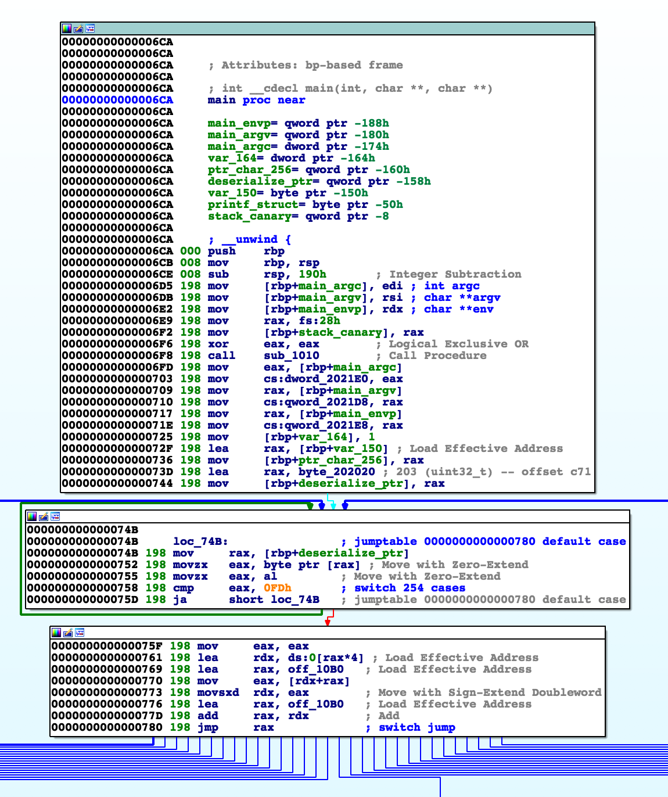
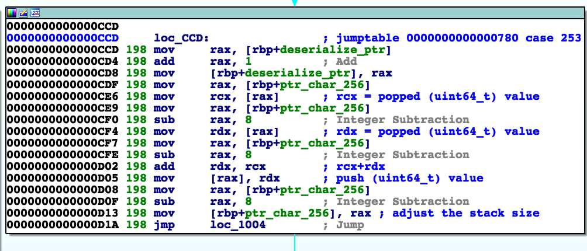

# Jackinthebox - Reversing (300)

Time to start packing those presents for the holidays! We found this packed gift for you to open with the correct passphrase...

(please note that the recovered string is not in flag format, it must be enclosed in AOTW{...})

Download: [RLVHiHiX8cKDgtgkaPfN22UKkmmrUUdU-jackinthebox.tar.xz](https://s3.amazonaws.com/advent2018/RLVHiHiX8cKDgtgkaPfN22UKkmmrUUdU-jackinthebox.tar.xz) [(mirror)](./static/RLVHiHiX8cKDgtgkaPfN22UKkmmrUUdU-jackinthebox.tar.xz)

## Reversing

This challenge was fairly straightforward, but took a lot of work to figure out exactly what the program was doing and then (once understood), how we could use that to figure out the flag.

I used IDApro for my disassembly, but didn't really need any of the special features it offered for this challenge. Pulling open the binary, we find that the majority of the code is in `main` and it has the program has a huge switch statement. Below is the start of main and if you're familiar enough with disassembly you'll see a couple components which are helpful later.



Following the part where each of the program arguments are saved off, there are two structures/data chunks which are used throughout the binary. The four instructions below save off a part of the stack and store as a pointer in `[rbp+ptr_char_256]` (my own variable naming), and then save off a pointer from the data section `byte_202020` in `[rbp+deserialize_ptr]` (again, my own naming).

```
.text:000000000000072F 198 lea     rax, [rbp+var_150] ; Load Effective Address
.text:0000000000000736 198 mov     [rbp+ptr_char_256], rax
.text:000000000000073D 198 lea     rax, byte_202020
.text:0000000000000744 198 mov     [rbp+deserialize_ptr], rax
```

The switch statement seems to be a large loop which pulls off the next element at `deserialize_ptr`, performs some action using `ptr_char_256`, and then increments `deserialize_ptr`. After looking at several of the elements in the switch statement, it becomes clear that this program is implementing some sort of stack-based argument evalutaion such as [Reverse Polish notation](https://en.wikipedia.org/wiki/Reverse_Polish_notation). In this case, `ptr_char_256` is the stack and the elements of `deserialize_ptr` are instructions. For example if the "instruction" is 253, then the action is to pop `element1`, pop `element2`, add the two values, and push `element1+element2` back onto the stack. These operations are often optimized so that instruction doesn't subtract from and add to the stack pointer after each of those pop/push instructions which makes things slightly more difficult to read. Put another way, instead of pop (subtract 8), pop (subtract 8), push (add 8), the optimized program will just perform the instruction in-place and then subtract 8 at the end. By way of example, I annotated instruction 253 below.



Putting all of this together, we have to understand two things: (1) what the instructions are in the `jackinthebox` binary, and (2) now they're used to execute the instructions in the `.data` buffer `byte_202020`. I did the two of these together as they tend to make more sense that way, and to that end I disassembled the binary and re-wrote it in python. I believe the code below should be pretty self explanatory given the function/variable names, but in a couple places a hacked an instruction to return a result I wanted (for instance, one check will always return true if the first argument matches a pattern appropriate for this challenge).

```python
import sys
import struct
import binascii

def pushs(s):
	global buf
	global buf_index
	print('\tpushs',s)
	assert len(s) == 8
	buf_index += 8
	buf = buf[:buf_index] + s + buf[buf_index+8:]

def pushb(b):
	global buf
	global buf_index
	print('\tpushb',b)
	buf_index += 8
	buf = buf[:buf_index] + struct.pack('<B',b) + buf[buf_index+1:]

def pushi(i):
	global buf
	global buf_index
	print('\tpushi',i)
	buf_index += 8
	buf = buf[:buf_index] + struct.pack('<I',i) + buf[buf_index+4:]

def pushq(q):
	global buf
	global buf_index
	print('\tpushq','0x%016x'%q,q)
	buf_index += 8
	buf = buf[:buf_index] + struct.pack('<Q',q) + buf[buf_index+8:]

def pops():
	global buf
	global buf_index
	s = buf[buf_index:buf_index+8]
	print('\tpops',s)
	buf_index -= 8
	return s

def popb():
	global buf
	global buf_index
	b, = struct.unpack('<B',buf[buf_index:buf_index+1])
	print('\tpopb',b)
	buf_index -= 8
	return b

def popi():
	global buf
	global buf_index
	i, = struct.unpack('<I',buf[buf_index:buf_index+4])
	print('\tpopi',i)
	buf_index -= 8
	return i

def popq():
	global buf
	global buf_index
	l, = struct.unpack('<Q',buf[buf_index:buf_index+8])
	print('\tpopq',l)
	buf_index -= 8
	return l

deref_lookup = {}
deref_lookup[b'prntf+32'] = bytes(8)
p_argv_offset = 0
p_argv1 = b'AaQ'

def deref(x):
	y = None
	if x == b'p_argv  ':
		y = b'argv    '
	elif x == b'argv+8  ':
		y = b'p_argv1 '
	elif x == b'prntf+24':
		y = b'p_argv1*'
	elif x == b'p_argv1*':
		if p_argv_offset >= len(p_argv1):
			y = 0
		else:
			y = p_argv1[p_argv_offset]
	elif x == b'prntf+32':
		y = deref_lookup[x]
	elif x == b'prntf+40':
		y = deref_lookup[x]
	elif x == b'prntf+56':
		y = deref_lookup[x]

	if y is None:
		print('\tderef', x)
		sys.exit(0)
	print('\tderef', x, '->', y)	
	return y

def set_deref(x,y):
	print('\tderef(%s) := %s'%(str(x),str(y)))
	if x == b'prntf+24' and y == b'p_argv1 ':
		deref_lookup[x] = y
		global p_argv_offset
		p_argv_offset = 0
	elif x == b'prntf+24' and y == b'p_argv1*':
		deref_lookup[x] = y
	elif x == b'prntf+32':
		deref_lookup[x] = y
	elif x == b'prntf+40':
		deref_lookup[x] = y
	elif x == b'prntf+56':
		deref_lookup[x] = y

	else:
		sys.exit(0)

def stoq(s):
	q, = struct.unpack('<I',s)
	return q

if __name__ == '__main__':
	f = open('./jackinthebox','rb')
	f.seek(0x2020)
	arr = f.read(0x21d0-0x2020)
	f.close()

	global buf
	global buf_index
	buf = bytes(256+72)
	buf_index = 0

	print(len(arr),list(arr))
	index = 0
	while index < len(arr):
		ch = arr[index]
		assert len(buf) == 256+72
		print('buf (%d):'%buf_index,binascii.hexlify(buf[:buf_index+8]))
		print('(%d / 0x%04x):'%(index,index+0x2020), ch)
		index += 1
		if ch == 55:
			eax = popi()
			rsi = popq()
			print('\t%d<<%d'%(rsi,eax))
			pushq((rsi<<eax)%2**64)
			continue
		elif ch == 226:
			print('\t'+str(arr[index:index+4]))
			off, = struct.unpack('<I',arr[index:index+4])
			l = popi()
			if l == 0:
				index += 4
				print('\t+%d'%4)
			else:
				index += off
				print('\t+%d'%off)
			continue
		elif ch == 2:
			x = popb()
			pushi(x)
			continue
		elif ch == 214:
			eax = popi()
			edx = popi()
			print('\tcompare',eax,'!=',edx)
			if eax != edx:
				cl = 1
			else:
				cl = 0
			pushi(cl)
			continue
		elif ch == 21:
			print('\t'+str(arr[index:index+4]))
			off, = struct.unpack('<I',arr[index:index+4])
			index += 4
			pushi(off)
			continue
		elif ch == 40:
			print('\t'+str(arr[index:index+4]))
			off, = struct.unpack('<I',arr[index:index+4])
			index += 4
			print('\tprintf')
			break # not complete yet!
			continue
		elif ch == 16:
			eax = popi()
			rsi = popq()
			print('\t%d>>%d'%(rsi,eax))
			pushq(rsi>>eax)
			continue
		elif ch == 20:
			print('\t'+str(arr[index:index+8]))
			off, = struct.unpack('<Q',arr[index:index+8])
			index += 8
			pushq(off)
			continue
		elif ch == 159:
			rdx = popq()
			rcx = popq()
			print('\t0x%x^0x%x'%(rdx,rcx))
			pushq(rdx^rcx)
			continue
		elif ch == 176:
			rcx = pops()
			rdx = popq()
			if rcx == b'argv    ':
				pushs(b'argv+%-3d' % rdx)
			else:
				pushq(stoq(rcx)+rdx)
			continue
		elif ch == 137:
			rax = pops()
			rdx = pops()
			set_deref(rax,rdx)
			continue
		elif ch == 95:
			rax = popq()
			rdx = popq()
			print('\tcompare',hex(rax),'==',hex(rdx))
			if rax == rdx:
				cl = 1
			else:
				cl = 0
			if rax == 0xfa99d19034215e19: cl = 1 # HACK HACK HACK
			pushi(cl)
			continue
		elif ch == 61:
			rdx = pops()
			edx = deref(rdx)
			pushi(edx)
			continue
		elif ch == 35:
			rdx = pops()
			rax = pops()
			set_deref(rax,rdx)
			continue
		elif ch == 237:
			edx = popb()
			pushq(edx)
			continue
		elif ch == 111:
			rdx = popq()
			pushq(rdx)
			continue
		elif ch == 220:
			edx = popi()
			pushq(edx)
			continue
		elif ch == 203:
			print('\t'+str(arr[index:index+4]))
			eax, = struct.unpack('<I',arr[index:index+4])
			index += 4
			pushs(b'prntf+%02d'%eax)
			continue
		elif ch == 253:
			rcx = popq()
			rdx = popq()
			print('\tadd')
			pushq(rdx+rcx)
			continue
		elif ch == 146:
			edx = popi()
			rax = pops()
			set_deref(rax,edx)
			continue
		elif ch == 211:
			rdx = pops()
			pushb(deref(rdx) & 0xff)
			continue
		elif ch == 223:
			print('\t'+str(arr[index:index+4]))
			eax, = struct.unpack('<I',arr[index:index+4])
			index += 4
			if eax == 1:
				pushs(b'p_argv  ') # lea rax, [rbp+main_argv] ; mov [rdx], rax
			elif eax == 2:
				pushs(b'p_envp  ')
			elif eax == 0:
				pushs(b'p_argc  ')
			continue
		elif ch == 217:
			print('\t'+str(arr[index:index+4]))
			off, = struct.unpack('<I',arr[index:index+4])
			if off > 0x80000000:
				off -= 2**32
			print('\t+=', off)
			index += off
			continue
		elif ch == 194:
			rcx = popq()
			rdx = popq()
			print('\tsubtract')
			pushq(rcx-rdx)
			continue
		elif ch == 19:
			rdx = pops()
			pushs(deref(rdx))
			continue
		elif ch == 24:
			rax = popq()
			rcx = popq()
			print('\tmultiply')
			pushq(rax*rcx)
			continue
		elif ch == 193:
			print('\t'+str(arr[index:index+4]))
			off, = struct.unpack('<I',arr[index:index+4])
			index += 4
			break # not complete yet!
			continue
		elif ch == 82:
			rdx = pops()
			pushs(deref(rdx))
			continue
		elif ch == 36:
			rcx = pops()
			rdx = popq()
			if rcx == b'p_argv1*':
				p_argv_offset += rdx
				pushs(b'p_argv1*')
			else:
				print('TODO'*20,'checkme!')
				pushq(stoq(rcx)+rdx)
			continue
		elif ch == 181:
			eax = popi()
			print('\treturn', eax)
			break
			sys.exit(0)

		break

	print('quitting with the remaining buffer:', arr[index:])
```

## Reading the Instructions

Running the code above will give you some very verbose output, but steping through it carefully we can see whats happening. For the purposes of testing, I've hardcoded a couple dereferenced values, and in particular set `argv[1] == "AaQ"`, a string chosen arbitrarily for its ASCII bit representation. Some pseudocode for whats happening is:

```
value1 ('prntf+32' above) := 0
ptr := argv[1]
while (ch := *ptr++) != 0:
	value1 := (value1<<16) + (value1<<6) - (value1) + ch

value2 ('prntf+40' above) := 0
ptr := argv[1]
while (ch := *ptr++) != 0:
	value2 := (value2<<5) ^ (value2>>27) ^ ch

if 0xfa99d19034215e19 == value1 and 0x9e38e1fb7629b == value2:
	"you win"
```

## Finding the Flag

From here, we have two bit-operations and checks on `argv[1]`, so it seems pretty apparent that whatever `argv[1]` is supposed to be will give us the flag. The first operation can be simplified to `value1 := 0x1003f * value1 + ch` which involves some messy multiplication, however the second operation is simply bitwise XORs so is a better first pass for solving the flag. Given that the target for `value2` is 51 bits long and the left bitshift is `5`, the target `argv[1]` is going to be a 10-character value. To make things further complicated, ASCII characters will be 7-bits long so there will be _at least_ a 2-bit overlap/exhaust for possible valid characters.

I chose to write one recursive function which attempted to enumerate all valid flags, and then when a possible match was found - pass it to the multiply (`value1` check) operation for a secondary check. My recursive function basically will just try each character, pad the current flag out to 10 characters, compute the entire XORed `value2`, check the top `~ 5*N` bits against the target value, and the continue the recursion. With this we can then simply run the solver function to find the flag.

My python code was:

```python
# this works as a check
def solve_mult(argv1):
	val = 0
	for ch in argv1:
		val = 0x1003f*val+ch
		val = val % 2**64
	print('MUL 0xfa99d19034215e19 0x%016x compare'%val, argv1)
	if val == 0xfa99d19034215e19:
		print('JACKPOT!', argv1)
		sys.exit(0)
	return val

# THIS GETS US TO THE SOLUTION: b'M@ry-Xma55'
def solve_xor(argv1=b''):
	target = 0x0009e38e1fb7629b
	for ch in range(0x20,0x7f):#b'\x00ABCDEFGHIJKLMNOPQRSTIVWXYZabcdefghijklmnopqrstuvwxyz_0123456789':
		_argv1 = argv1 + bytes([ch]) + bytes(9-len(argv1))
		val = 0
		for _ch in _argv1:
			val = (val>>27)^(val<<5)^_ch
		N = 5*(10-len(argv1))+2
		if (val>>N) == (target>>N):
			if len(argv1) >= 9:
				if val == target:
					print('XOR 0x%016x 0x%016x'%(val,val^target), _argv1)
					solve_mult(_argv1)
			else:
				solve_xor(argv1+bytes([ch]))

if __name__ == '__main__':
	solve_xor()
```

And with a little patience, this runs and gives us the solution:

```
$ time ./challenge10.py 
...
XOR 0x0009e38e1fb7629b 0x0000000000000000 b'M@ry-XlBWu'
MUL 0xfa99d19034215e19 0xfa98d0b3f678b559 compare b'M@ry-XlBWu'
XOR 0x0009e38e1fb7629b 0x0000000000000000 b'M@ry-XlCu5'
MUL 0xfa99d19034215e19 0xfa98d0b4f714cbfc compare b'M@ry-XlCu5'
XOR 0x0009e38e1fb7629b 0x0000000000000000 b'M@ry-XlCvU'
MUL 0xfa99d19034215e19 0xfa98d0b4f715cc5b compare b'M@ry-XlCvU'
XOR 0x0009e38e1fb7629b 0x0000000000000000 b'M@ry-XlCwu'
MUL 0xfa99d19034215e19 0xfa98d0b4f716ccba compare b'M@ry-XlCwu'
XOR 0x0009e38e1fb7629b 0x0000000000000000 b'M@ry-Xma55'
MUL 0xfa99d19034215e19 0xfa99d19034215e19 compare b'M@ry-Xma55'
JACKPOT! b'M@ry-Xma55'

real	4m35.877s
user	4m2.382s
sys	0m0.992s
```
