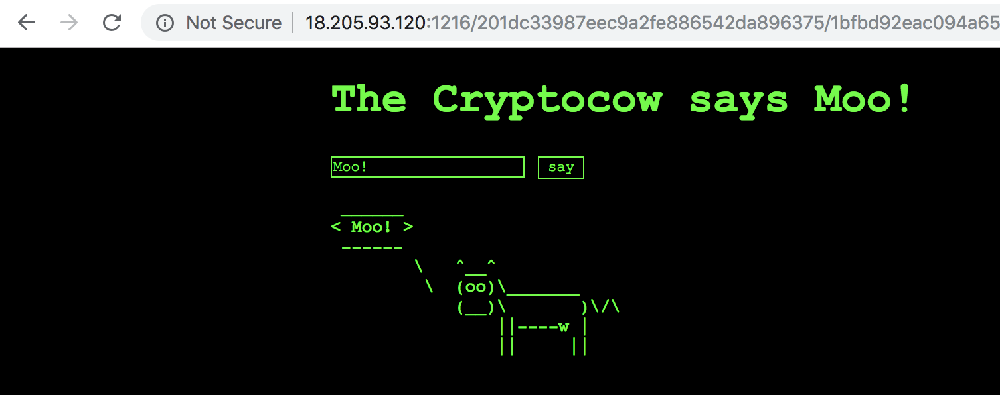
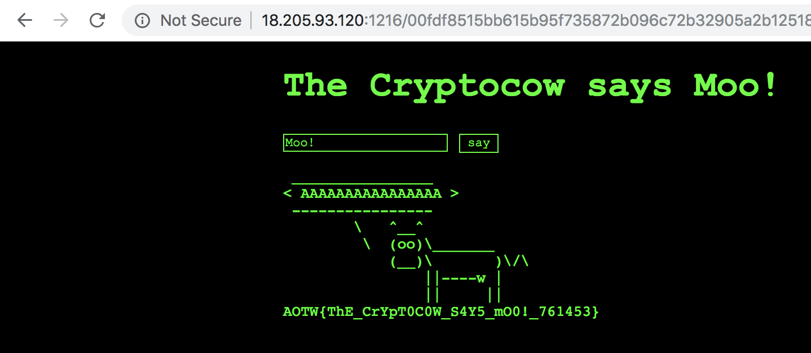

# Cryptocow - Web/crypto (200)

The cryptocow says Moo!

Service: http://18.205.93.120:1216

## Problem Triage

Cryptocow serves up a web page with a single text box in a form. Putting in any text redirects you to a new page with the ASCII art for the [Linux cowsay utility](https://linux.die.net/man/1/cowsay).



Some of my immediate observations:

* Each submission redirects to you a page formatted as http://18.205.93.120:1216/HEXDATA1/HEXDATA2
* Identical submissions create identical redirects (no randomness)
* There's no obvious escapes or command injection (quote, semicolon, etc.)
* Altering HEXDATA2 randomly gives the error code "Message Authentication Code does not match plain text."
* Altering HEXDATA1 randomly (but keeping it the same size) gives the same error above or "Invalid padding"
* More text makes larger HEXDATA1 and this is always a multiple of 32
* More text does not change the length of HEXDATA2 and it is always 40

Given all this and the type of problem (web/crypto), I conclude that

* HEXDATA1 is the input text, encrypted in blocks of 128 bits.
* HEXDATA1 is padded with some standard padding (likely [PKCS5](https://en.wikipedia.org/wiki/Padding_(cryptography))).
* HEXDATA2 is a MAC, likely a SHA1 hash given the size of 160 bits.
* Further testing of long repeating strings gives repeated blocks in HEXDATA1 so the cipher mode is likely [ECB](https://en.wikipedia.org/wiki/Block_cipher_mode_of_operation#Electronic_Codebook_(ECB)).
* The error code for HEXDATA2 suggests that the MAC is not an HMAC, which means that the solution could involve a [hash length extension attack](https://en.wikipedia.org/wiki/Length_extension_attack).
* Given the escaping, the solution also probably involves crafting a
message which defeats whatever that escaping is.

With this all in mind I set out to do two things - craft an arbitrary encrypted message of my choice and then turn an existing MAC into a MAC for that message using the length extension attack.

## Creating Encrypted Messages

This initially didn't seem too difficult as most messages were just straight encrypted into bytes/blocks. However, all bytes above 0x80 were not encoded correctly. Knowing that I would HAVE to have a message with byte value 0x80 in it for the length extension attack this proved a major hurdle that I didn't get until much later. The remainder of this section will only discuss HEXDATA1, the first part of the redirected URL.

First off, the basics. Creating simple messages encodes easily. Some examples (note the block repeats)

```
a0ecebbccf8f94dc35e009135329e006 <- A (block1=A+pad)
00fdf8515bb615b95f735872b096c72b 4ec388f0c7d2e0ca1c56b2d815676d04 <- AAAAAAAAAAAAAAAA (block1=A*16, block2=pad)
00fdf8515bb615b95f735872b096c72b a0ecebbccf8f94dc35e009135329e006 <- AAAAAAAAAAAAAAAAA (block1=A*16, block2=A+pad)
00fdf8515bb615b95f735872b096c72b 00fdf8515bb615b95f735872b096c72b a0ecebbccf8f94dc35e009135329e006 <- AAAAAAAAAAAAAAAAAAAAAAAAAAAAAAAAA (block1 = A*16, block2=A*16, block3=A+pad)
```

This showed me that the encrypted blocks were really in ECB mode and revealed some padded blocks. After trying mostly ASCII characters, this doesn't work _quite_ as well. To determine the padding I tried getting PKCS5 pads in known locations, and eventually this worked:

```
0c13ddddc6a21c297e81fd8005ac9c07 <- \x10
3e80d3b980bc98e8a58cc7938721df60 a60241c7141435cb2ef5617aefa92110 <- \x10 * 16
3e80d3b980bc98e8a58cc7938721df60 4ec388f0c7d2e0ca1c56b2d815676d04 a60241c7141435cb2ef5617aefa92110 <- \x10 * 32
```

As you can see, the first block (`3e80d3b980bc98e8a58cc7938721df60`) does not seem to align with what I expected the padding to be, but the middle block of the last attempt (`4ec388f0c7d2e0ca1c56b2d815676d04`). After some experimenting with various blocks, sizes, and configurations, it became apparent that any non-alphanumeric string was escaped with a quote (`'`) in the first and last character, so `\x10 * 16` is really encoded as `' + \x10 * 16 + '`. With this in mind, I can still get (mostly) any arbitrary string in the right position if i prefix it with 15 characters (for example `A * 15`) to force it into the second block.

Even with this, there are two more cases where this break. First, escaping a single quote with a single quote obviously doesn't work. A lot of testing revealed that a single quote was escaped as five characters plus the single quote on the beginning and end of the string. At first I thought I was onto something with a flag, but alas it turned out to be a slick encoding. I'll skip to the end - a single quote is encoded as the characters `'"'"'`. This works well on the command line - it basically ends the single quote string, makes a double quote string with one character, and starts the single quote string again. Simple command line experimentation shows that this effectively escapes quotes (to prevent command injection):

```
$ cowsay 'no";injection'"'"';found";here'
 ____________________________
< no";injection';found";here >
 ----------------------------
        \   ^__^
         \  (oo)\_______
            (__)\       )\/\
                ||----w |
                ||     ||
```

And lastly, the trickiest part were all the characters above 0x80. Simple encodings showed that these always encoded to the same string:

```
6220e26095a4a5af3a101d953d2e4b0c b'\x80'
6220e26095a4a5af3a101d953d2e4b0c b'\x81'
6220e26095a4a5af3a101d953d2e4b0c b'\xff'
cd2ea39542d0e3d3d487e8f43d956aec 7860755feef86cafa5706bf672dfc43c b'\x80\x80\x80\x80\x80'
cd2ea39542d0e3d3d487e8f43d956aec 7860755feef86cafa5706bf672dfc43c b'\x81\x81\x81\x81\x81'
cd2ea39542d0e3d3d487e8f43d956aec 7860755feef86cafa5706bf672dfc43c b'\xff\xff\xff\xff\xff'
cd2ea39542d0e3d3d487e8f43d956aec 30bde148dca5da2b8d9af3c500d90150 4ec388f0c7d2e0ca1c56b2d815676d04 b'\x80\x80\x80\x80\x80\x80\x80\x80\x80\x80'
cd2ea39542d0e3d3d487e8f43d956aec 30bde148dca5da2b8d9af3c500d90150 4ec388f0c7d2e0ca1c56b2d815676d04 b'\x81\x81\x81\x81\x81\x81\x81\x81\x81\x81'
cd2ea39542d0e3d3d487e8f43d956aec 30bde148dca5da2b8d9af3c500d90150 4ec388f0c7d2e0ca1c56b2d815676d04 b'\xff\xff\xff\xff\xff\xff\xff\xff\xff\xff'
```

This is absolutely no help if you need to encode a `\x80` for the second part of the challenge. Furthermore, it appears that each of these is encoded to three characters with no idea what those three bytes actually are. (Note: In retrospect looking at the returned HTML, these bytes are printed in HTML as `\xc3\xaf\xc2\xbf\xc2\xbd` which UTF-8 decodes as the three bytes `\xef\xbf\xbd` which google suggests is "U+FFFD REPLACEMENT CHARACTER" /shrug).

Anyways, after a LOT of trying and thinking about the problem I was stuck. I slept on it and the next day realized that I should try a valid UTF-8 string instead of just single bytes. This turns out to work! That is, bytes like `\xc2\x80` encode to themselves! With this in mind, I can encrypt a string like the following to construct a block which starts with the `\x80` character:

```
b29f969eec978a21c756d1135a6a1fef 'AAAAAAAAAAAAAA\xc2
32905a2b12518533501085bb90697ca6 \x80\x00\x00\x00\x00\x00\x00\x00\x00\x00\x00\x00\x00\x00\x00\x00
7860755feef86cafa5706bf672dfc43c ' + pad
```

Given the slow drip of solves for Cryptocow and the low solve count in the competition the importance of this UTF-8 encoding trick can't be understated. Figuring this out is pretty much critical for solving the problem as a whole.

## Constructing a Hash Extension

I could've started from scratch doing this, but a little google searching found a [github project hlextend](https://github.com/stephenbradshaw/hlextend) which did the trick. For this I tried a lot of different parameters, but it turned out to be rather simple:

```python
import hlextend
sha = hlextend.new('sha1')
ext = sha.extend(';cat flag','AAAAAAAAAAAAAAAA',16,'99947b7f062484ee5042fde51722e83110bd0e87',raw=True)
ext = 'AAAAAAAAAAAAAAAA\x80\x00\x00\x00\x00\x00\x00\x00\x00\x00\x00\x00\x00\x00\x00\x00\x00\x00\x00\x00\x00\x00\x00\x00\x00\x00\x00\x00\x00\x00\x01\x00;cat flag\x07\x07\x07\x07\x07\x07\x07'

mac = sha.hexdigest()
mac = 'ee8ea7dc16fb01e7babefcedb67200e1416e8078'
```

Using the prior work creating arbitrary blocks of my choice, it was a simple exercise to construct an encrypted block for each of the 16-byte chunks in `ext` above and submit the answer.

## Solution

[http://18.205.93.120:1216/00fdf8515bb615b95f735872b096c72b32905a2b12518533501085bb90697ca686673d04864699cfbc3b30177e711664a7df11dbdc8a5347a951bcd97f6f7602/ee8ea7dc16fb01e7babefcedb67200e1416e8078](http://18.205.93.120:1216/00fdf8515bb615b95f735872b096c72b32905a2b12518533501085bb90697ca686673d04864699cfbc3b30177e711664a7df11dbdc8a5347a951bcd97f6f7602/ee8ea7dc16fb01e7babefcedb67200e1416e8078)



