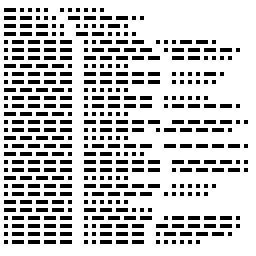

# Boxy - Reversing (200)

You're given a spec resembling Chinese for a proprietary image protocol. Study the attached example images to discover the flag in the captured transmission.

Download: [9WuDhiY44X1XvtCZNOFQyN4qANxnLlnu-boxy.tar.xz](https://s3.amazonaws.com/advent2018/9WuDhiY44X1XvtCZNOFQyN4qANxnLlnu-boxy.tar.xz) [(mirror)](./static/9WuDhiY44X1XvtCZNOFQyN4qANxnLlnu-boxy.tar.xz)

## Deciphering the Samples

This challenge provided several sample images along with binaries which were presumably used to create those files. There was also a text file with chinese characters, but that proved much less helpful. I started the challenge by looking at the examples and attempting to figure out how the binary bytes translated into the images.

**0x00.bin**

This image was simply a 256x256 all-white iamge. Looking at the binary, I created the following notes, and without much to go on I moved to the next example.

```
01ff 02ff header?  255x255
0300 ff00 all white?
```

**0x01.bin**

This example had eight images of different colors. Looking at the binary, I could isolate the differences where each image was created and created these notes. This began to form some sense of "instructions" encoded as two-byte values. From this it seemed clear that `01` and `02` were for setting a size, `03` was for setting a color, and `ff` was for painting the current settings to an image.

```
01ff 02ff set selected area 255x255
0300 ff00 set white, paint ; white
0301 ff00 set black, paint ; black
0302 ff00 set red, paint ; red
0303 ff00 set lime, paint ; lime
0304 ff00 set yellow, paint ; yellow
0305 ff00 set blue, paint ; blue
0306 ff00 set magenta, paint ; magenta
0307 ff00 set cyan, paint ; cyan
```

**0x02.bin**

This example had four images. The first only had the upper-left square filled in, the second had upper-left and lower-right, the third upper-left and lower-right in white, upper-right in black, and the last image had a checkerboard with the lower-left also filled in black. My notes for this began to paint a better picture for what was going on. This example introduced `04` and `05` which I took to mean set the offset. Since each square was checkerboard-ed in the image, the values for each offset seem to match up with the corresponding images.

```
0180 0280 set selected area 128x128
0300 ff00 set white, paint
0480 0580 set offset 128x128
ff00      paint
0301      set black
0400 0580 set offset 0,128
ff00      paint
0480 0500 set offset 128,0
ff00      paint

upper left quadrant white
bottom right quadrant white
upper right black
bottom left black
```

**0x03.bin**

The last example had five images. The first was all white as we've seen before, but the last four each painted a new rectangle. Again, my notes are below and showed that the binary added four new instructions `06`, `07`, `08`, and `09`. Based on context in the image and the fact that the painted rectangles weren't all in the same location, but the `04` and `05` set offset instructions weren't found, I took these to mean add or subtract from one of the image dimensions.

```
01ff 02ff 0300 ff00 set selected area 255x255, set white, paint
0108 0210 set selected area 8x16 (y by x)
0458 0558 set offset 0x58,0x58 == 88,88
0302      set red
0740      ???? add 0x40 to y?
ff00      paint
0303      set green
0940      ???? add 0x40 to x?
ff00      paint
0304      set yellow
0640      ???? sub 0x40 from y?
ff00      paint
0305      set blue
0840      ???? sub 0x40 from x?
ff00      paint

blue at 90,90
yellow at 154,90
greep at 152,152
red at 90,153
(red green yellow blue mini boxes)
```

## Creating an Encoder

Using all of this, I wrote up a simple python script to ingest a binary file and produce a test image. This worked for all four examples.

```python
from PIL import Image, ImageDraw
import binascii

img = Image.new('RGB', (256,256), color='white')
draw = ImageDraw.Draw(img)

data = open('./boxy/examples/0x03.bin','rb').read()
posx = 0
posy = 0
sizex = 0
sizey = 0
color = 'white'
fillall = False
for i in range(0,len(data),2):
	print('%02x%02x'%(data[i],data[i+1]), end=' ', flush=True)
	if data[i] == 1:
		sizey = data[i+1]
		print('sizey',sizey)
	elif data[i] == 2:
		sizex = data[i+1]
		print('sizex',sizex)
	elif data[i] == 3:
		if data[i+1] == 0:
			color = 'white'
		elif data[i+1] == 1:
			color = 'black'
		elif data[i+1] == 2:
			color = 'red'
		elif data[i+1] == 3:
			color = 'lime'
		elif data[i+1] == 4:
			color = 'yellow'
		elif data[i+1] == 5:
			color = 'blue'
		elif data[i+1] == 6:
			color = 'magenta'
		elif data[i+1] == 7:
			color = 'cyan'
		else:
			print('unknown color', data[i+1])
		print('color', color)
	elif data[i] == 4:
		posy = data[i+1]
		print('posy ==',posy)
	elif data[i] == 5:
		posx = data[i+1]
		print('posx ==',posx)
	elif data[i] == 6:
		posx -= data[i+1]
		print('posx -',data[i+1],'=',posx)
	elif data[i] == 7:
		posx += data[i+1]
		print('posx +',data[i+1],'=',posx)
	elif data[i] == 8:
		posy -= data[i+1]
		print('posy -',data[i+1],'=',posy)
	elif data[i] == 9:
		posy += data[i+1]
		print('posy +',data[i+1],'=',posy)
	elif data[i] == 0xff:
		print('rectangle',[posx,posy,posx+sizex-1,posy+sizey-1],color)
		if posx == 0 and posy == 0 and sizex == 255 and sizey == 255:
			if fillall:
				continue
			fillall = True
		draw.rectangle([posy,posx,posy+sizey-1,posx+sizex-1],fill=color)
	else:
		print(data[i:i+2])

img.save('boxy/test.png')
```

However, this didn't work off immediately for the `reverseme` binary. Using this program, I started disassembling the binary and found many instances of the instructions `01ff02ff030004000500` which for all intents and purposes clears the current image. Even if this were removed, the `reverseme` binary repeatedly set one offset to the same position `047e` thereby overwriting previous painted sections. After some tweaking, I finally decided to just modify the `reverseme` binary bytes so that it wouldn't clear the image and the overwriting command was replaced with one to skip to the next "line". This was done as follows and resulted in the image shown below.

```python
data = open('./boxy/reverseme','rb').read()
data = data.replace(binascii.unhexlify('01ff02ff030004000500'),b'')
data = data.replace(binascii.unhexlify('047e'),binascii.unhexlify('0404'))
data = data.replace(binascii.unhexlify('0508'),binascii.unhexlify('0708'))
```



In one last piece of the challenge, you may notice that each "line" here corresponds to sets of 5-6 dots and dashes. This is pretty readily recognizable as morse code with a trailing dot at the end of each. Decoding this morse code gives all integer values, each of which corresponds to an ASCII byte value for the flag:

```
65 A
79 O
83 T
87 W
123 {
111 o
107 k
95 _
104 h
105 i
95 _
115 s
111 o
95 _
109 m
121 y
95 _
110 n
97 a
109 m
101 e
95 _
105 i
115 s
95 _
98 b
111 o
120 x
121 y
125 }

AOTW{ok_hi_so_my_name_is_boxy}
```
