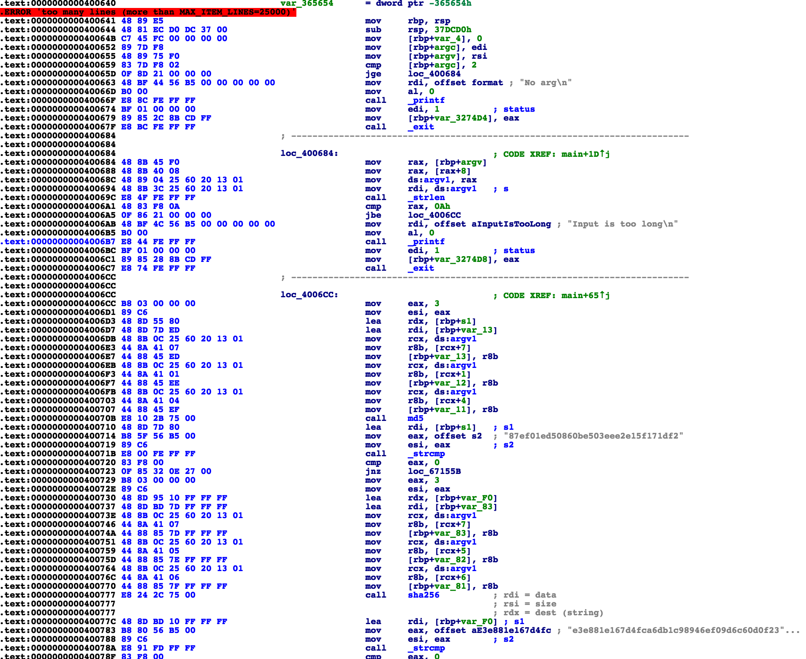

# Xmastree - Reversing (200)

Santa's nerdy cousin has decorated a chrismas tree...

(please note that the recovered string is not in flag format, it must be enclosed in AOTW{...})

Download: [RSgDs9FA4Qv3nuBc2H0Ft4IAG5JaDGGL-xmastree.tar.xz](https://s3.amazonaws.com/advent2018/RSgDs9FA4Qv3nuBc2H0Ft4IAG5JaDGGL-xmastree.tar.xz) [(mirror)](./static/RSgDs9FA4Qv3nuBc2H0Ft4IAG5JaDGGL-xmastree.tar.xz)

## Reversing

Fair warning - I went about solving this problem in the most convoluted way possible. In retrospect I should have just noticed the 'flag' string and traced the program backwards, but alas I took a brute force method constraint-solver type method.

Opening up the `xmastree` binary we see a __very large__ main function which seems to be very repetative. A look at the first couple instructions (shown below) shows that the program is expecting a 10-character `argv[1]` - presumably our flag value.



Following the argument check, is a chunk of instructions we see repeated throughout the binary. An example is shown below

```
.text:00000000004006CC B8 03 00 00 00                                mov     eax, 3
.text:00000000004006D1 89 C6                                         mov     esi, eax
.text:00000000004006D3 48 8D 55 80                                   lea     rdx, [rbp+s1]
.text:00000000004006D7 48 8D 7D ED                                   lea     rdi, [rbp+var_13]
.text:00000000004006DB 48 8B 0C 25 60 20 13 01                       mov     rcx, ds:argv1
.text:00000000004006E3 44 8A 41 07                                   mov     r8b, [rcx+7]
.text:00000000004006E7 44 88 45 ED                                   mov     [rbp+var_13], r8b
.text:00000000004006EB 48 8B 0C 25 60 20 13 01                       mov     rcx, ds:argv1
.text:00000000004006F3 44 8A 41 01                                   mov     r8b, [rcx+1]
.text:00000000004006F7 44 88 45 EE                                   mov     [rbp+var_12], r8b
.text:00000000004006FB 48 8B 0C 25 60 20 13 01                       mov     rcx, ds:argv1
.text:0000000000400703 44 8A 41 04                                   mov     r8b, [rcx+4]
.text:0000000000400707 44 88 45 EF                                   mov     [rbp+var_11], r8b
.text:000000000040070B E8 10 2B 75 00                                call    md5
.text:0000000000400710 48 8D 7D 80                                   lea     rdi, [rbp+s1]   ; s1
.text:0000000000400714 B8 5F 56 B5 00                                mov     eax, offset s2  ; "87ef01ed50860be503eee2e15f171df2"
.text:0000000000400719 89 C6                                         mov     esi, eax        ; s2
.text:000000000040071B E8 00 FE FF FF                                call    _strcmp
.text:0000000000400720 83 F8 00                                      cmp     eax, 0
.text:0000000000400723 0F 85 32 0E 27 00                             jnz     loc_67155B
```

These instructions take three characters from `argv[1]` using the instruction which reference (in this example) `[rcx+7]`, `[rcx+1]`, `[rcx+4]`, concatenates them into a three-character string, and then passes them to a function. The result of this is then checked against a hexadecimal string of length 32, 40, or 64. If successful, the program jumps to another such instruction, otherwise it drops to the next instruction.

Picking this apart further, I found that the function called just before the hexadecimal string comparison is equivalent to the MD5, SHA1, or SHA256 hash functions. To do this I took a quick look at each function, found that some of the constants in each matched those respective hash functions, and then attempted to find a 3-character string which would hash to some tentative hexadecimal strings found in the binary. Given that these are probably the three most common hash functinos, this assumption wasn't too far off the mark and turned out to be right.

So basically the instruction chunks each check a set of constraints (three characters in `argv[1]`) and if true or false branch to the next instruction chunk. Also interspersed through the function are several `printf` calls which print various tree-like things such as "This branch has a red ball", or "There is some glitter on this branch".

## Writing a Constraint Solver

As mentioned at the top, I went about solving this problem in the most complicated way possible. With that said, I wrote a python program to parse several things

* Compute all possible 3-character hashes for MD5, SHA1, and SHA256
* Identify all constraint chunks, which characters of `argv[1]` they use, and what hex string they are compared against
* Identify all program locations which print a string

With all of that written, my program crawls through going _forward_ through the `xmastree` main function, and looking for a consistent set of constraints. This program is given in full below and takes a fairly long time to complete.

```python
#!/usr/bin/env python2

from __future__ import print_function
from Crypto.Hash import MD5
from Crypto.Hash import SHA as SHA1
from Crypto.Hash import SHA256
from collections import defaultdict
import pwnlib
import binascii
import json
import os

max_addr = 0x410000
max_addr = 0xc00000

def md5(data):
	if type(data) == list:
		data = bytes(data)
	elif type(data) == str:
		 data = data.encode('ascii')
	return MD5.new(data).hexdigest()

def sha1(data):
	if type(data) == list:
		data = bytes(data)
	elif type(data) == str:
		 data = data.encode('ascii')
	return SHA1.new(data).hexdigest()

def sha2(data):
	if type(data) == list:
		data = bytes(data)
	elif type(data) == str:
		 data = data.encode('ascii')
	return SHA256.new(data).hexdigest()

ALPHABET = ''.join(chr(x) for x in range(0x21,0x7f))

def create_hashes():

	if os.path.exists('hashes.json'):
		hashes = json.load(open('hashes.json'))
		print('loaded hashes.json')
		return hashes

	hashes = {}
	for ch1 in ALPHABET:
		for ch2 in ALPHABET:
			for ch3 in ALPHABET:
				hashes[md5(ch1+ch2+ch3)] = ch1+ch2+ch3
				hashes[sha1(ch1+ch2+ch3)] = ch1+ch2+ch3
				hashes[sha2(ch1+ch2+ch3)] = ch1+ch2+ch3

	json.dump(hashes,open('hashes.json','w'),indent=1)
	return hashes

def check_hashes(hashes):
	md5_targets = open('md5.txt').read().strip().split()
	sha1_targets = open('sha1.txt').read().strip().split()
	sha2_targets = open('sha2.txt').read().strip().split()

	chars_used = defaultdict(lambda:0)
	not_found = []
	for h in md5_targets:
		if h not in hashes:
			not_found.append(h)
			print(h,'???')
			continue
		print(h,hashes[h])
		chars_used[hashes[h][0]] += 1
		chars_used[hashes[h][1]] += 1
		chars_used[hashes[h][2]] += 1
	for h in sha1_targets:
		if h not in hashes:
			not_found.append(h)
			print(h,'???')
			continue
		print(h,hashes[h])
		chars_used[hashes[h][0]] += 1
		chars_used[hashes[h][1]] += 1
		chars_used[hashes[h][2]] += 1
	for h in sha2_targets:
		if h not in hashes:
			not_found.append(h)
			print(h,'???')
			continue
		print(h,hashes[h])
		chars_used[hashes[h][0]] += 1
		chars_used[hashes[h][1]] += 1
		chars_used[hashes[h][2]] += 1

	#print(not_found)
	print(len(not_found),'/',len(md5_targets)+len(sha1_targets)+len(sha2_targets))

	for ch in ALPHABET:
		print(ch,chars_used[ch])

def constraint_conflict(cons1,cons2):
	for i in cons1:
		if i in cons2 and cons2[i] != cons1[i]:
			return True
	for i in cons2:
		if i in cons1 and cons1[i] != cons2[i]:
			return True
	return False

def branch_solve(start_addr,hash_hash,printf_hash,cmp_hash,hashes,constraints={},path=[]):

	if start_addr >= max_addr:
		return []
	print(hex(start_addr),constraints,[hex(a) for a in path])

	# see if next address is in printf_hash or cmp_hash
	try:
		next_printf = min(addr for addr in printf_hash.keys() if addr >= start_addr)
	except:
		next_printf = 2**64
	try:
		next_cmp = min(addr for addr in cmp_hash.keys() if addr >= start_addr)
	except:
		next_cmp = 2**64

	if next_printf == 2**64 and next_cmp == 2**64:
		return []

	if next_printf < next_cmp:
		ans = (''.join(constraints.get(i,'.') for i in range(10)),printf_hash[next_printf],hex(next_printf))
		print('branch_solve:', ans, [hex(a) for a in path])
		return [ans]

	rbp_str, hash_str, next_addr = cmp_hash[next_cmp]
	(ch1,ch2,ch3) = hash_hash[rbp_str]
	new_constraints = {}
	new_constraints[ch1] = hashes[hash_str][0]
	new_constraints[ch2] = hashes[hash_str][1]
	new_constraints[ch3] = hashes[hash_str][2]

	# if we take the false path
	res1 = branch_solve(next_addr,hash_hash,printf_hash,cmp_hash,hashes,constraints,path+[start_addr])
	if constraint_conflict(constraints,new_constraints):
		return res1
	# if we take the true path
	for i in constraints:
		new_constraints[i] = constraints[i]
	res2 = branch_solve(next_cmp+1,hash_hash,printf_hash,cmp_hash,hashes,new_constraints,path+[start_addr])
	return res1+res2

def get_printf_hash(e):

	fname = 'printf_hash_%x.json' % max_addr
	if os.path.exists(fname):
		_printf_hash = json.load(open(fname))
		print('loaded %s'%fname)
		# adjust since keys are somehow actually strings, not ints
		printf_hash = {}
		for addr in _printf_hash:
			printf_hash[int(addr)] = _printf_hash[addr]
		return printf_hash

	printf_hash = {}
	for addr in e.search(binascii.unhexlify('48 BF 8D 58 B5 00 00 00 00 00'.replace(' ',''))):
		if addr >= max_addr: continue
		printf_hash[addr] = 'red ball'
	for addr in e.search(binascii.unhexlify('48 BF 41 58 B5 00 00 00 00 00'.replace(' ',''))):
		if addr >= max_addr: continue
		printf_hash[addr] = 'snow'
	for addr in e.search(binascii.unhexlify('48 BF 90 59 B5 00 00 00 00 00'.replace(' ',''))):
		if addr >= max_addr: continue
		printf_hash[addr] = 'green ball'
	for addr in e.search(binascii.unhexlify('48 BF 34 5B B5 00 00 00 00 00'.replace(' ',''))):
		if addr >= max_addr: continue
		printf_hash[addr] = 'lightbulb'
	for addr in e.search(binascii.unhexlify('48 BF F8 58 B5 00 00 00 00 00'.replace(' ',''))):
		if addr >= max_addr: continue
		printf_hash[addr] = 'empty'
	for addr in e.search(binascii.unhexlify('48 BF D2 58 B5 00 00 00 00 00'.replace(' ',''))):
		if addr >= max_addr: continue
		printf_hash[addr] = 'glitter'
	print(len(printf_hash), 'long printf_hash')

	json.dump(printf_hash,open(fname,'w'),indent=1)
	return printf_hash

def get_hash_hash(e):

	fname = 'hash_hash_%x.json' % max_addr
	if os.path.exists(fname):
		hash_hash = json.load(open(fname))
		print('loaded %s'%fname)
		return hash_hash

	ch_hash = {}
	ch_hash['[rcx]'] = 0
	ch_hash['[rcx+0x1]'] = 1
	ch_hash['[rcx+0x2]'] = 2
	ch_hash['[rcx+0x3]'] = 3
	ch_hash['[rcx+0x4]'] = 4
	ch_hash['[rcx+0x5]'] = 5
	ch_hash['[rcx+0x6]'] = 6
	ch_hash['[rcx+0x7]'] = 7
	ch_hash['[rcx+0x8]'] = 8
	ch_hash['[rcx+0x9]'] = 9
	hash_hash = {}
	for addr in e.search(binascii.unhexlify('b803000000')):
		dis = e.disasm(addr,0x720-0x6cc)
		#print('='*80)
		#print(dis)
		lines = dis.split('\n')
		dest = lines[2].split(',')[-1]
		#dest = lines[3].split(',')[-1]
		ch1 = ch_hash[lines[6].split()[-1]]
		ch2 = ch_hash[lines[10].split()[-1]]
		ch3 = ch_hash[lines[14].split()[-1]]

		print(hex(addr),dest,ch1,ch2,ch3)
		hash_hash[dest] = (ch1,ch2,ch3)

		if addr >= max_addr:
			break

	json.dump(hash_hash,open(fname,'w'),indent=1)
	return hash_hash

def get_cmp_hash(e,hash_hash,hashes):

	fname = 'cmp_hash_%x.json' % max_addr
	cmp_hash = {}
	for addr in e.search(binascii.unhexlify('83 F8 00 0F'.replace(' ',''))):

		if addr >= max_addr:
			break

		sub_value = (7+5+2+5)
		dis = e.disasm(addr-sub_value,19+9)
		#print('='*80)
		#print(dis)
		lines = dis.split('\n')
		while 'call' not in lines[3] or 'lea' not in lines[0] or 'mov' not in lines[1] or 'mov' not in lines[2]:
			sub_value -= 1
			dis = e.disasm(addr-sub_value,sub_value+9)
			#print(dis)
			lines = dis.split('\n')
		dest = lines[0].split(',')[-1]
		jmp = int(lines[5].split()[-1][2:],16)

		str_addr = lines[1].split(',')[-1]
		assert str_addr.startswith('0x')
		str_addr = int(str_addr[2:],16)
		str_hex = e.string(str_addr)

		addr = int(lines[0].strip().split(':')[0],16)

		#print(hex(addr),dest,str_hex,hex(jmp))
		print(hex(addr),hash_hash[dest],hashes[str_hex],hex(jmp))

		cmp_hash[addr] = (dest,str_hex,jmp)

	json.dump(cmp_hash,open(fname,'w'),indent=1)
	return cmp_hash

if __name__ == '__main__':

	hashes = create_hashes()

	e = pwnlib.elf.elf.ELF('./xmastree')

	printf_hash = get_printf_hash(e)

	hash_hash = get_hash_hash(e)

	cmp_hash = get_cmp_hash(e,hash_hash,hashes)

	start_addr = 0x4006CC
	arr = branch_solve(start_addr,hash_hash,printf_hash,cmp_hash,hashes)
	for a in arr:
		print(a)
```

Running this to completion, there are several constraints which result in a string being printed, but one jumps out as the likely flag `H4$Hy_XMA5`. Running this as the argument to `xmastree` prints the string "This is the trunk, it has a tiny flag pinned to it!" - a string I somehow missed in my first look at the binary.

